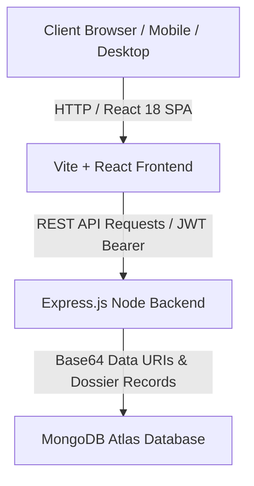

# ⚡ Turant — Official Healthcare Claims Register & Audit System

A full-stack, institutional Claims Management & Verification Platform built for patients to submit reimbursement dossiers and for insurance assessment officers to review, audit, sanction, or reject claim applications with official rubber stamps.

---

## 🌟 Live Production Links

- **Frontend Web App (Vercel)**: [https://turant-main.vercel.app](https://turant-main.vercel.app)
- **Backend API Server (Render)**: [https://turants-backend.onrender.com](https://turants-backend.onrender.com)
- **GitHub Repository**: [https://github.com/mahilmithranks/Turant.git](https://github.com/mahilmithranks/Turant.git)

---

## 🏗️ Architecture & How the Code Runs

The application follows a decoupled Client-Server architecture designed for **zero-delay UI rendering**, **high responsiveness across all devices**, and **100% persistent document storage**.



### 1. Application Initialization Flow (`App.jsx`)
- **Synchronous Auth Hydration**: On initial load, `App.jsx` reads `localStorage` for `turant_token` and `turant_user` to instantly hydrate state and eliminate page flickering.
- **Backend Warmup Ping**: `index.html` includes an immediate async ping to `/api/health` so Render free-tier containers wake up before the user clicks login.
- **Role-Based Routing**: Based on `currentUser.role`:
  - `patient` → Renders `<PatientPortal />` (Submit claim form & live claims tracker).
  - `insurer` → Renders `<InsurerPortal />` (Register filter drawer, LEDGER table/mobile dossier cards, and rubber stamp auditor).

---

### 2. Patient Claim Submission Execution Flow
1. Patient fills out the submission form (`PatientPortal.jsx`) with claim amount (₹), medical description, and uploads proof receipts/prescriptions.
2. The document file buffer is read and converted into a **Base64 Data URI string** (`data:image/png;base64,...` or `data:application/pdf;base64,...`).
3. The claim payload is sent to `POST /api/claims` via `fetch`.
4. The server writes the document directly inside the MongoDB document. Because files are saved as Data URIs, **uploaded documents are never lost** when cloud containers restart.
5. **Optimistic UI Update**: The frontend immediately appends the new claim to React state `claims`, updating the patient's register index instantly without extra network roundtrips.

---

### 3. Insurer Dossier Audit & Sanction Flow
1. Insurer views the **Claims Register** (`InsurerPortal.jsx`). On desktop screens, it displays a full LEDGER table; on mobile devices (≤768px), it automatically transforms into **touch-friendly Dossier Cards**.
2. Insurer opens a claim to inspect the dossier in `<ClaimReviewModal />`.
3. Insurer selects a decision status:
   - **`Approved`**: Imprints **`SANCTIONED`** rubber stamp with approved reimbursement payout amount.
   - **`Rejected`**: Imprints **`REJECTED`** rubber stamp with rejection rationale note.
4. Insurer submits review to `PATCH /api/claims/:id/review`.
5. Local state updates instantly, rendering the authentic green/red rubber stamp on the dossier register.

---

## 🛠️ Tech Stack & Components

- **Frontend**: React 18, Vite, Custom Glassmorphism CSS Design System, Lucide Icons.
- **Backend**: Node.js, Express.js, JWT (`jsonwebtoken`), Bcryptjs, Multer file buffer processor.
- **Database**: MongoDB Atlas / Mongoose ORM.
- **Code-Splitting & Performance**: Async Google Fonts, lazy-loaded React portals (`Suspense`), Base64 Data URI persistence.

---

## 🚀 How to Run Locally

### Prerequisites
- Node.js v18 or higher
- npm v9 or higher

### Step 1: Clone the Repository
```bash
git clone https://github.com/mahilmithranks/Turant.git
cd Turant
```

### Step 2: Start the Backend Server
```bash
cd backend
npm install
npm run dev
```
> The API server will run on `http://localhost:5000`.

### Step 3: Start the Frontend Application
In a separate terminal window:
```bash
cd frontend
npm install
npm run dev
```
> The frontend application will run on `http://localhost:3000` (or `http://localhost:5173`).

---

## 🔑 Demo Evaluation Accounts

You can test both user roles immediately using these pre-seeded credentials or the quick-login buttons on the login screen:

| Role | Email | Password | Access Rights |
|---|---|---|---|
| **Patient** | `patient@turant.com` | `password123` | Log claims, track dossier status & rubber stamps |
| **Insurer** | `insurer@turant.com` | `password123` | Audit register, sanction amounts, apply rubber stamps |

---

## 📁 Key Project Files

```text
Turant/
├── backend/
│   ├── server.js              # Express API entry point & CORS configuration
│   ├── db/store.js            # Mongoose schemas & fallback DB handlers
│   └── routes/
│       ├── authRoutes.js      # Register, Login & JWT profile endpoints
│       └── claimRoutes.js     # Submit, fetch & review claim endpoints
└── frontend/
    ├── index.html             # Preload hints, async fonts & backend warmup ping
    ├── src/
    │   ├── App.jsx            # Main app container, state & optimistic handlers
    │   ├── index.css          # Design tokens, glassmorphism & media queries
    │   ├── config.js          # API base URL configuration helper
    │   └── components/
    │       ├── Navbar.jsx          # Header with logo & compact user pill
    │       ├── AuthPage.jsx        # Login & Signup screen with feature highlights
    │       ├── PatientPortal.jsx   # Patient claim submission & tracker
    │       ├── InsurerPortal.jsx   # Claims register table & mobile card view
    │       ├── CustomSelect.jsx    # Custom glassmorphism dropdown component
    │       └── ClaimReviewModal.jsx# Dossier review & rubber stamp audit modal
```

---

## 📄 License
Licensed under the MIT License.